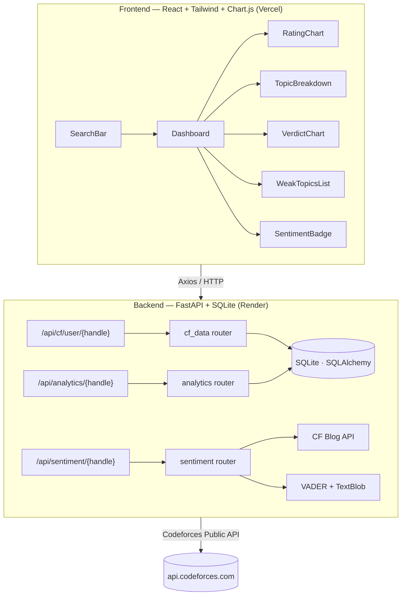

# CP Analytics Dashboard

> **Portfolio project** — A full-stack competitive programming analytics web app.
> Analyzes your Codeforces history with charts, weak-topic identification, and NLP community sentiment.


---

## Architecture



### Key Design Decisions
| Concern | Choice | Reason |
|---------|--------|--------|
| Database | SQLite via SQLAlchemy | Zero-config, single file, perfect for portfolio scale |
| Cache TTL | 1 hour | Avoid CF rate-limits; "Refresh" button for manual invalidation |
| CF submissions | Last 1,000 | CF API limit without auth |
| NLP | VADER (70%) + TextBlob (30%) | VADER is optimised for short social text; TextBlob provides cross-check |
| Charts | react-chartjs-2 | Mature, well-documented, flexible |

---

## Folder Structure

```
.
├── backend/
│   ├── app/
│   │   ├── config.py            # Pydantic Settings
│   │   ├── database.py          # SQLAlchemy engine + session
│   │   ├── main.py              # FastAPI entry point
│   │   ├── models/
│   │   │   ├── db_models.py     # ORM tables
│   │   │   └── schemas.py       # Pydantic request/response models
│   │   ├── routers/
│   │   │   ├── cf_data.py       # Fetch + cache CF data
│   │   │   ├── analytics.py     # Compute analytics
│   │   │   └── sentiment.py     # NLP sentiment
│   │   └── services/
│   │       ├── cf_client.py     # Async CF API wrapper
│   │       ├── analytics_engine.py  # Pure analytics functions
│   │       └── nlp_engine.py    # VADER + TextBlob pipeline
│   ├── tests/
│   │   ├── test_analytics.py
│   │   └── test_cf_client.py
│   ├── .env.example
│   └── requirements.txt
│
├── frontend/
│   ├── src/
│   │   ├── api/cfApi.js
│   │   ├── components/
│   │   │   ├── LoadingSpinner.jsx
│   │   │   ├── RatingChart.jsx
│   │   │   ├── SearchBar.jsx
│   │   │   ├── SentimentBadge.jsx
│   │   │   ├── TopicBreakdown.jsx
│   │   │   ├── VerdictChart.jsx
│   │   │   └── WeakTopicsList.jsx
│   │   ├── pages/
│   │   │   ├── Dashboard.jsx
│   │   │   └── LandingPage.jsx
│   │   ├── App.jsx
│   │   └── index.css
│   ├── .env.example
│   ├── vercel.json
│   └── package.json
│
├── render.yaml
└── README.md
```

---

## Local Setup

### Prerequisites
- Python 3.11+
- Node.js 18+
- pip

### Backend

```bash
cd backend

# 1. Install dependencies
pip install -r requirements.txt

# 2. Copy env file (defaults work out-of-the-box)
cp .env.example .env

# 3. Run the API
uvicorn app.main:app --reload

# API docs available at: http://localhost:8000/docs
```

### Frontend

```bash
cd frontend

# 1. Install dependencies
npm install

# 2. Copy env file
cp .env.example .env
# Edit VITE_API_BASE_URL if your backend is not on port 8000

# 3. Run the dev server
npm run dev

# Open http://localhost:5173
```

### Run Tests

```bash
cd backend
pytest tests/ -v
```

---

## API Endpoints

| Method | Endpoint | Description |
|--------|----------|-------------|
| `GET` | `/api/cf/user/{handle}` | Fetch + cache user info, submissions, rating history |
| `DELETE` | `/api/cf/user/{handle}` | Clear cache (force re-fetch) |
| `GET` | `/api/analytics/{handle}` | Compute analytics from cached data |
| `GET` | `/api/sentiment/{handle}` | NLP sentiment for most-recent contest blog |
| `GET` | `/docs` | Interactive Swagger UI |
| `GET` | `/health` | Health check |

---

## Deployment

### Backend → Render (Free Tier)

1. Push code to GitHub.
2. Create a **New Web Service** on [Render](https://render.com).
3. Connect your repo; Render auto-detects `render.yaml`.
4. Set the `CORS_ORIGINS` environment variable to your Vercel frontend URL.
5. Deploy — Render will run `pip install -r requirements.txt` and start uvicorn.

> **Note:** SQLite file is ephemeral on Render's free tier. Data resets on each redeploy.
> For persistence, mount a Render Disk (paid) or switch to PostgreSQL.

### Frontend → Vercel

1. Push `frontend/` to GitHub (or a subfolder).
2. Create a **New Project** on [Vercel](https://vercel.com).
3. Set **Root Directory** → `frontend`.
4. Add environment variable: `VITE_API_BASE_URL` → your Render backend URL.
5. Deploy — Vercel handles the Vite build automatically.
6. SPA routing is handled by `vercel.json`.

---

## Features

- **Rating Progression** — Line chart of every contest result with smooth bezier curves and gradient fill
- **Topic Breakdown** — Horizontal bar chart of top 15 tags by unique problems solved
- **Difficulty Distribution** — Count of solved problems per rating bucket (<1200 … 2400+)
- **Verdict Breakdown** — Doughnut chart (AC / WA / TLE / CE / RE) with percentages
- **Weak Topics** — Table sorted by acceptance rate; highlights tags with low success
- **NLP Sentiment** — VADER + TextBlob analysis of blog comments from most-recent contest
- **Smart Caching** — SQLite cache with 1-hour TTL; manual refresh available
- **Error Handling** — Invalid handles, API timeouts, and rate-limit errors surfaced gracefully

## Known Limitations

1. **Submissions cap** — CF API returns max 1,000 submissions without authentication. Prolific users (tourist, etc.) may have incomplete data.
2. **Sentiment availability** — Blog comment search is heuristic (keyword match in recent CF actions). May return `available: false` for older or unusual contest names.
3. **SQLite scalability** — Not suitable for concurrent multi-user production use; fine for demo/portfolio.
4. **No auth** — Any handle can be searched; data is shared in the public DB (no user isolation).
5. **CF API rate limits** — ~1 request/2 sec; simultaneous requests from many users could trigger 503s.
6. **Render free tier** — Service sleeps after 15 min inactivity; first request after sleep may be slow (~30s cold start).

---

## Screenshots

> _Add dashboard screenshot here after first run_


---

## Tech Stack

| Layer | Tech |
|-------|------|
| Backend | Python · FastAPI · SQLAlchemy · SQLite |
| NLP | VADER Sentiment · TextBlob |
| HTTP Client | httpx (async) |
| Frontend | React 18 · Vite · Tailwind CSS v3 |
| Charts | Chart.js · react-chartjs-2 |
| HTTP | Axios |
| Icons | Lucide React |
| Deployment | Render (backend) · Vercel (frontend) |
