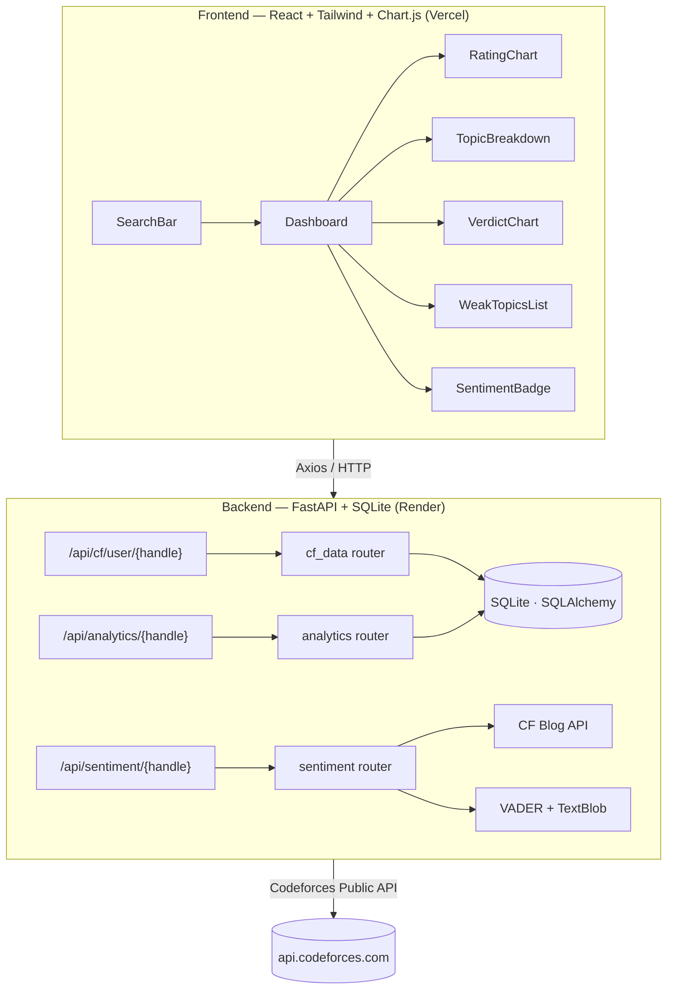

# CP Analytics Dashboard

A full-stack web app that analyzes a Codeforces profile — rating progression, topic strengths/weaknesses, verdict breakdown, and NLP-based community sentiment — in one clean dashboard.

**🔗 Live Demo:** https://cp-analytics-dashboard-five.vercel.app/

**🔗 API Docs (Swagger):** https://cp-analytics-dashboard.onrender.com/docs

**📦 Repo:** https://github.com/ankitrmishra01/cp-analytics-dashboard

> ⚠️ The backend runs on Render's free tier, which sleeps after 15 minutes of inactivity. The first request after idle time may take **30–50 seconds** to respond — this is expected, not a bug.

---

## 📸 Screenshots

<!--
ADD SCREENSHOTS HERE. Suggested shots to capture from the LIVE deployed site (not localhost):

1. 

   → The landing page with the search bar, before searching a handle.

2. 

   → Full dashboard after searching a handle, showing the top stat cards
     (Total Solved, Submissions, Current Rating, Max Rating).

Save all images inside a `docs/` folder at the repo root, then reference them
below using the same markdown image syntax as this section.
-->

### Landing Page


### Dashboard Overview


### Topic Breakdown & Verdict Distribution


### Weak Topics


### NLP Community Sentiment


---

## ✨ Features

- **Rating Progression** — line chart of rating history across every rated contest
- **Topic Breakdown** — top solved tags/topics, visualized as a bar chart
- **Difficulty Distribution** — solved problems grouped by rating bucket
- **Verdict Distribution** — Accepted / Wrong Answer / TLE / etc., as a doughnut chart
- **Weak Topics** — tags with high attempt count but low acceptance rate, to guide practice
- **NLP Community Sentiment** — VADER + TextBlob sentiment analysis on recent contest blog comments
- **Smart Caching** — SQLite-backed cache with a manual refresh option, to avoid hammering the Codeforces API
- **Graceful Error Handling** — invalid handles, API timeouts, and rate limits are surfaced clearly in the UI

---

## 🛠️ Tech Stack

| Layer | Technology |
|---|---|
| Backend | Python · FastAPI · SQLAlchemy · SQLite |
| NLP | VADER Sentiment · TextBlob |
| HTTP Client | httpx (async) |
| Frontend | React 18 · Vite · Tailwind CSS |
| Charts | Chart.js · react-chartjs-2 |
| HTTP | Axios |
| Deployment | Render (backend) · Vercel (frontend) |

---

## 🏗️ Architecture



### Key Design Decisions

| Concern | Choice | Reason |
|---|---|---|
| Database | SQLite via SQLAlchemy | Zero-config, single file, sufficient for portfolio scale |
| Cache TTL | 1 hour | Avoids Codeforces rate limits; manual "Refresh" button available |
| Submissions | Last 1,000 | Codeforces API limit without authentication |
| NLP | VADER (primary) + TextBlob (cross-check) | VADER is tuned for short, informal social text |
| Charts | react-chartjs-2 | Mature, flexible, well-documented |

---

## 📁 Folder Structure

```
.
├── backend/
│   ├── app/
│   │   ├── config.py
│   │   ├── database.py
│   │   ├── main.py
│   │   ├── models/
│   │   │   ├── db_models.py
│   │   │   └── schemas.py
│   │   ├── routers/
│   │   │   ├── cf_data.py
│   │   │   ├── analytics.py
│   │   │   └── sentiment.py
│   │   └── services/
│   │       ├── cf_client.py
│   │       ├── analytics_engine.py
│   │       └── nlp_engine.py
│   ├── tests/
│   ├── .env.example
│   └── requirements.txt
│
├── frontend/
│   ├── src/
│   │   ├── api/cfApi.js
│   │   ├── components/
│   │   ├── pages/
│   │   ├── App.jsx
│   │   └── index.css
│   ├── .env.example
│   ├── vercel.json
│   └── package.json
│
├── docs/                 # screenshots referenced in this README
├── render.yaml
├── LICENSE
└── README.md
```

---

## 🚀 Local Setup

### Prerequisites
- Python 3.11+
- Node.js 18+

### Backend

```bash
cd backend
pip install -r requirements.txt
cp .env.example .env
uvicorn app.main:app --reload
```

API docs available at `http://localhost:8000/docs`.

### Frontend

```bash
cd frontend
npm install
cp .env.example .env       # set VITE_API_BASE_URL if backend isn't on port 8000
npm run dev
```

Open `http://localhost:5173`.

### Run Tests

```bash
cd backend
pytest tests/ -v
```

---

## 🔌 API Endpoints

| Method | Endpoint | Description |
|---|---|---|
| `GET` | `/api/cf/user/{handle}` | Fetch + cache user info, submissions, rating history |
| `DELETE` | `/api/cf/user/{handle}` | Clear cache (force re-fetch) |
| `GET` | `/api/analytics/{handle}` | Compute analytics from cached data |
| `GET` | `/api/sentiment/{handle}` | NLP sentiment for the most recent contest blog |
| `GET` | `/docs` | Interactive Swagger UI |
| `GET` | `/health` | Health check |

---

## ☁️ Deployment

### Backend → Render (Free Tier)
1. Push to GitHub.
2. Create a **New Web Service** on [Render](https://render.com), root directory `backend`.
3. Build command: `pip install -r requirements.txt`
4. Start command: `uvicorn app.main:app --host 0.0.0.0 --port $PORT`
5. Set `CORS_ORIGINS` env var to your Vercel URL (no trailing slash).

### Frontend → Vercel
1. Import the repo on [Vercel](https://vercel.com), root directory `frontend`.
2. Framework preset: Vite (auto-detected).
3. Set `VITE_API_BASE_URL` env var to your Render backend URL.

---

## ⚠️ Known Limitations

1. **Submissions cap** — Codeforces API returns a maximum of 1,000 submissions without authentication; very prolific users may show incomplete data.
2. **Sentiment availability** — finding the "correct" blog for a recent contest is best-effort; the sentiment card is hidden gracefully if no match is found.
3. **SQLite scalability** — fine for demo/portfolio use, not intended for concurrent multi-user production traffic.
4. **No authentication** — any handle can be searched; there's no per-user data isolation.
5. **Render free tier** — the service spins down after 15 minutes of inactivity; the first request afterward can take 30–50 seconds.

---

## 📄 License

This project is licensed under the [MIT License](LICENSE) — free to use, modify, and distribute.

---

## 🙋 Author

**Ankit Mishra**
GitHub: [@ankitrmishra01](https://github.com/ankitrmishra01)
